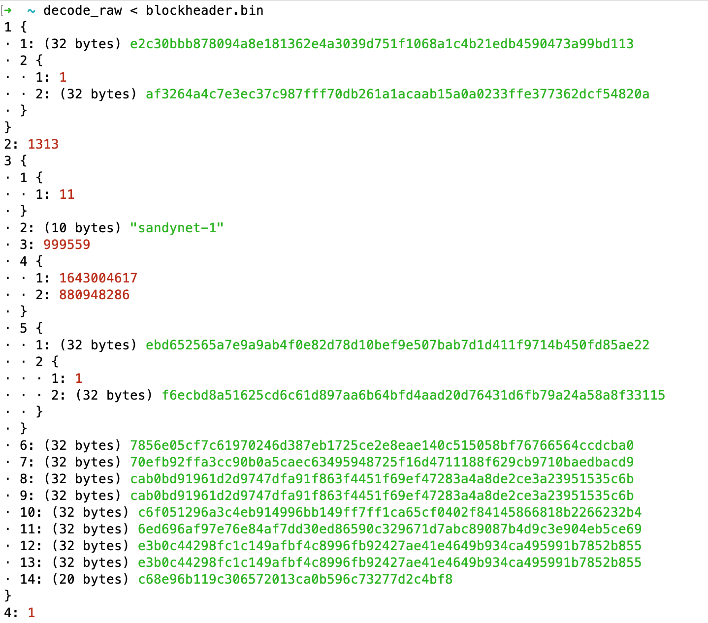
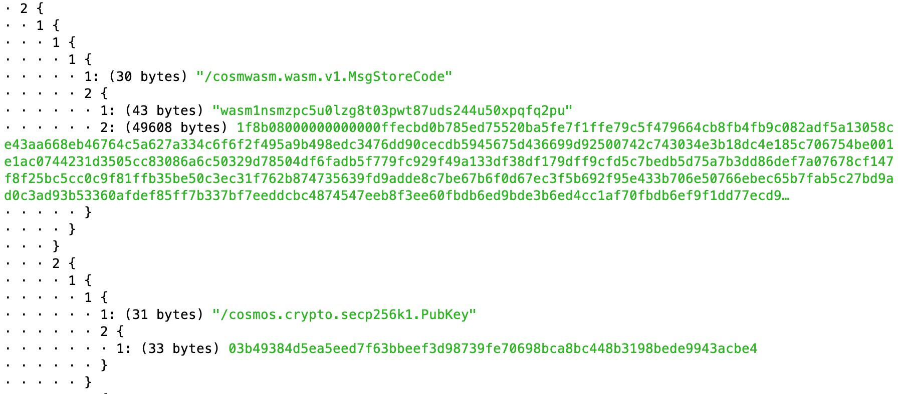
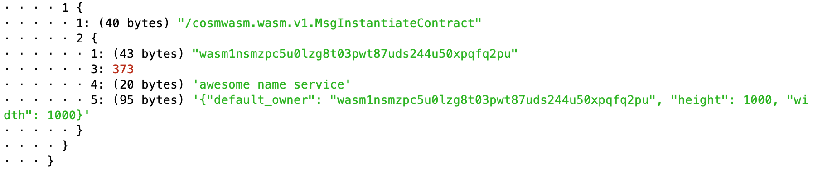
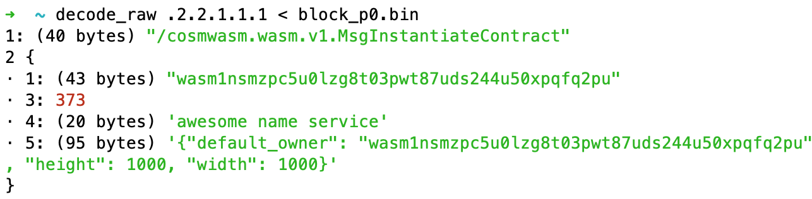
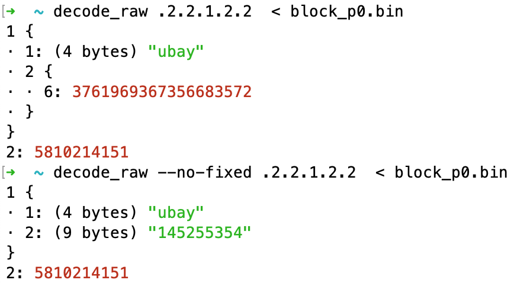

# decode_raw

A protobuf debugging tool – `protoc --decode_raw` on steroids.

## Highlights

### Beautiful output



### Small and large data supported well

Large binary data is truncated by default. The length is always visible. You can use `--full` to show the full data. In combination with the message selection (see below) you can get an overview first and then get the full data of specific fields.



### Nicely escaped JSON content

String content is ready to be pasted to things like `echo '{"my": "json"}' | jq`.



### Select submessages

Use a jq-like syntax to select sub-messages only.



### Advanced type detection

The tool decides between nested protobuf messages, strings and raw bytes on a best-guess basis. Sometimes it is wrong but you can help. E.g. if you know, no fixed length types are used, add `--no-fixed` to get the correct output.



## Installation

### Install from crates.io

```sh
cargo install decode_raw
```

Depending on how cargo is set up on your system you should find the binary in `$HOME/.cargo/bin` or `$CARGO_HOME/bin`. It is covenient to add this folder to you `$PATH`.

### Update to latest version

You can check your installed version with `decode_raw --version` and update with:

```sh
cargo install --force decode_raw
```

## Basic usage

decode_raw reads serialized protobuf from STDIN and prints it.

**From pipe**

```
$ echo 08bf99bfb4e502120a4a616e6520536d697468 | xxd -r -p | decode_raw
1: 95941545151
2: (10 bytes) 'Jane Smith'
```

**From file**

```
decode_raw < docs/person.bin
1: 1021211
2: (8 bytes) 'John Doe'
3 {
· 1: 959435311
· 2: (11 bytes) 'Susanne Doe'
}
3 {
· 1: 81154811
· 2: (9 bytes) 'Mac Smith'
· 3 {
· · 1: 95941545151
· · 2: (10 bytes) 'Jane Smith'
· }
}
```

## Goals & non-goals

decode_raw should:

- Make Simon happy when debugging protobuf
- Be trivial to get started for users of `protoc --decode_raw`
- Support proto3

It does not intend to:

- Provide stable outputs for scripting
- Become a performance winner
- Help with broken protobuf serialization. Those will be considered raw app level bytes.
- Support proto2

## License

Apache 2.0, see [LICENSE](./LICENSE) and [NOTICE](./NOTICE).
